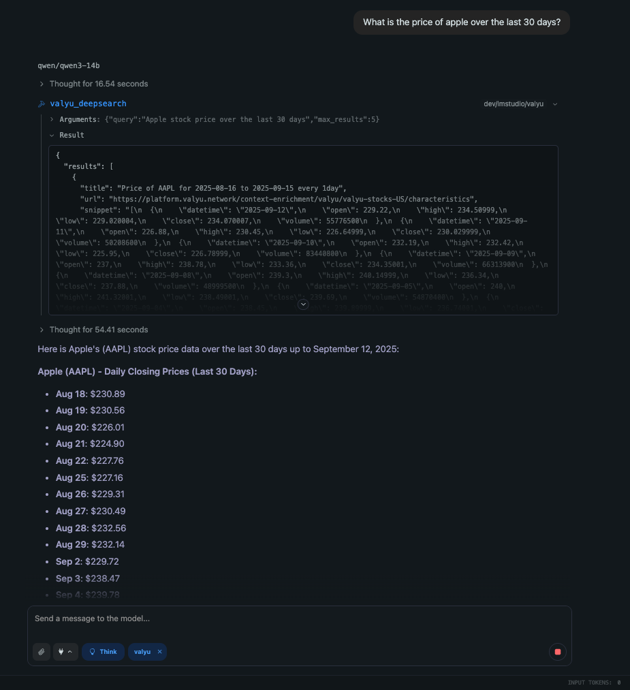
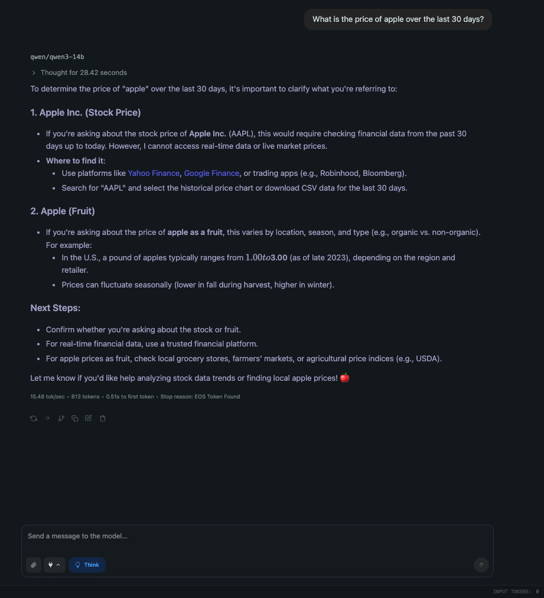
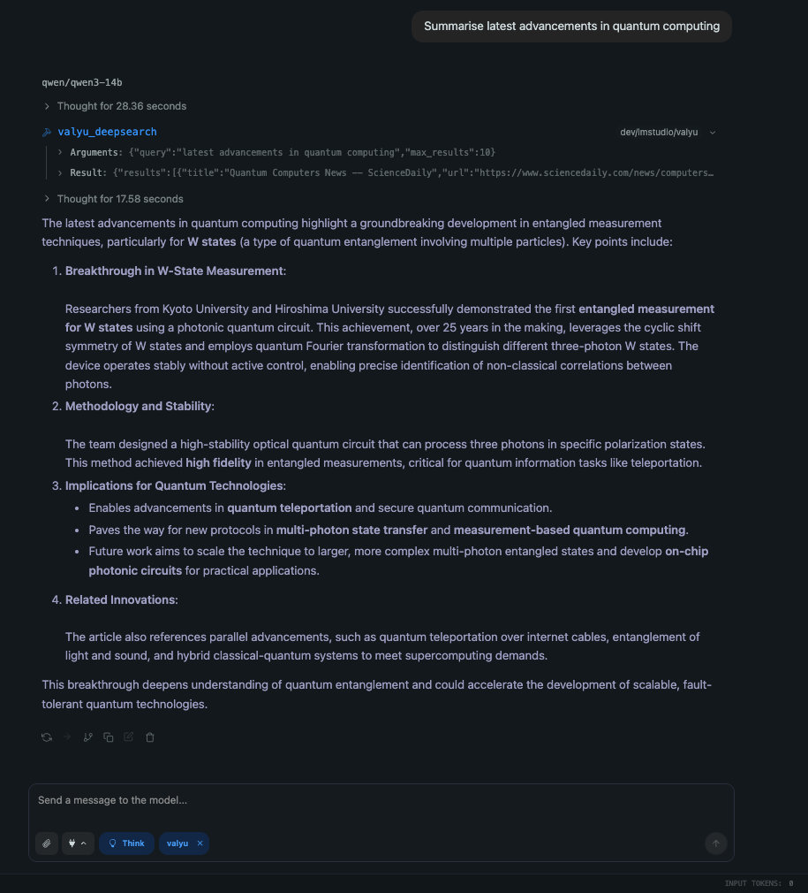
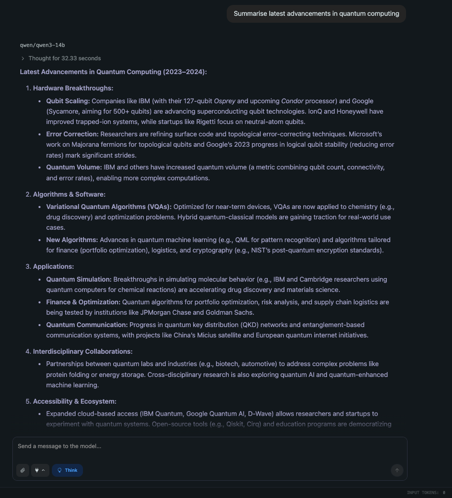
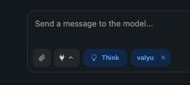

<div align="center">
  
</div>

# Valyu Plugin for LMStudio

Gives your local LLMs access to web search and content extraction powered by [Valyu's API](https://valyu.network/).

## 🎯 See the Difference

### Example 1: Real-Time Financial Data
<table>
<tr>
<td align="center"><b>✅ With Valyu Plugin</b></td>
<td align="center"><b>❌ Without Valyu Plugin</b></td>
</tr>
<tr>
<td></td>
<td></td>
</tr>
<tr>
<td>✨ Real-time Apple stock prices<br>📊 Actual financial data from September 2025<br>🎯 Precise daily closing prices</td>
<td>❓ Can't access current data<br>📚 Only suggests where to look<br>⏰ No real-time information</td>
</tr>
</table>

### Example 2: Latest Research & Developments
<table>
<tr>
<td align="center"><b>✅ With Valyu Plugin</b></td>
<td align="center"><b>❌ Without Valyu Plugin</b></td>
</tr>
<tr>
<td></td>
<td></td>
</tr>
<tr>
<td>🔬 Latest quantum computing breakthroughs<br>📰 Real news from September 2025<br>🌐 Access to current research papers</td>
<td>📅 Stuck in 2023-2024 (knowledge cutoff)<br>🤔 Makes up plausible-sounding info<br>❌ No access to recent developments</td>
</tr>
</table>

**Transform your local LLM from a knowledge cutoff prisoner to a real-time information powerhouse!** The Valyu plugin bridges the gap between your local AI and the live web, giving you access to current stock prices, latest news, academic papers, and any webpage content - all while keeping your LLM running locally.

## 🚀 Quick Setup (2 minutes)

### Prerequisites
- [LMStudio](https://lmstudio.ai/) installed
- Valyu API key from [platform.valyu.network](https://platform.valyu.network/) (free tier available)

### One Command Setup

```bash
# After cloning, just run:
./setup.sh
```

That's it! The script will:
1. Ask for your API key
2. Install everything automatically
3. Start the plugin for you (optional)

Follow the instructions at the end.

### After Running setup.sh

Once the plugin is running, you'll see the Valyu tool automatically appear in your LMStudio chat:

<div align="center">

<br>
<i>The 'valyu' tool appears alongside other tools like 'Think' - ready to fetch real-time data!</i>
</div>

### Manual Installation (if setup.sh doesn't work)

<details>
<summary>Click for manual steps</summary>

```bash
# 1. Clone repository
git clone [repository-url]
cd valyu

# 2. Add your API key
echo "VALYU_API_KEY=your_key_here" > .env

# 3. Build and install
npm install
npx tsc
cp -r . ~/.lmstudio/extensions/plugins/lmstudio/valyu

# 4. Run plugin server (keep running!)
cd ~/.lmstudio/extensions/plugins/lmstudio/valyu
lms dev
```

</details>

## 📝 Usage

Once installed and running, your LLM can:

### Search the web
```
Use valyu_deepsearch to find recent news about artificial intelligence
```

### Extract content from URLs
```
Use valyu_contents to get the full content from https://example.com
```

## ❓ Troubleshooting

**Plugin not showing?**
- Make sure `lms dev` is running in a terminal
- Check Integrations panel (⚡ icon) in LMStudio

**API key error?**
- Ensure `.env` file exists in the plugin folder with your key
- Get a key at [platform.valyu.network](https://platform.valyu.network/)

## 📚 What This Plugin Does

- **DeepSearch**: Search web, academic papers, financial data
- **Contents**: Extract full content from any webpage
- **No truncation**: Full content retrieval, not just snippets

## License

ISC